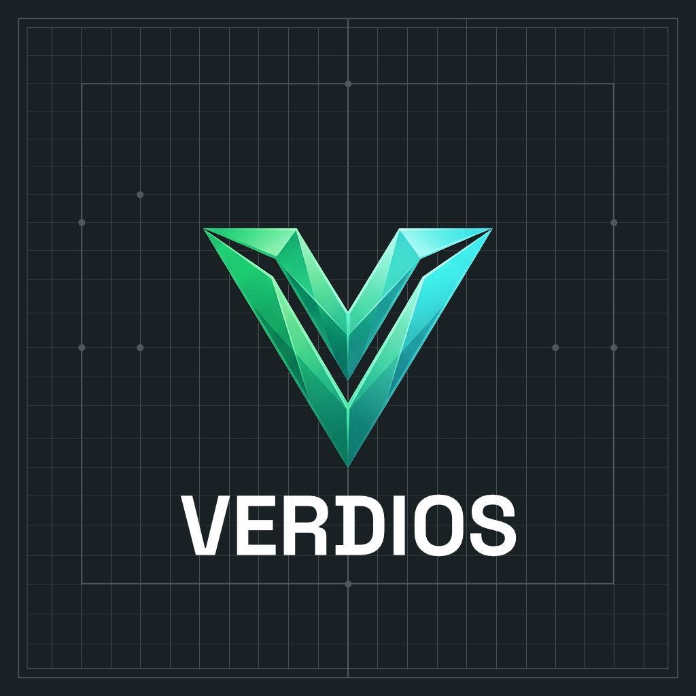

  
 
 
  
<strong>High-performance native desktop tools, modern web apps, mobile experiences, and containerized deployments.</strong>

  

    <a href="#-about">About</a> •
    <a href="#%EF%B8%8F-focus-areas">Focus Areas</a> •
    <a href="#-projects">Projects</a>
  

---

### 🚀 About
Verdios focuses on building high-efficiency, lightweight open-source systems, developer tooling, and self-hosted application suites.

### 🛠️ Focus Areas
* **💻 Desktop Native Apps:** Lightweight, fast UI applications built for local model management and utility workflows.
* **🌐 Web Applications:** Modern, highly responsive web apps and developer tools.
* **📱 Mobile Apps:** Cross-platform mobile tools designed for seamless connectivity and control.
* **🐳 Docker Compose & Containerization:** Easy-to-deploy self-hosted services and containerized environments.

### 📦 Projects
| Project | Stack | Description |
| :--- | :--- | :--- |
| **`swai`** | `Rust` | Desktop switch application for managing local AI model deployments |

---

  © 2026 Verdios

